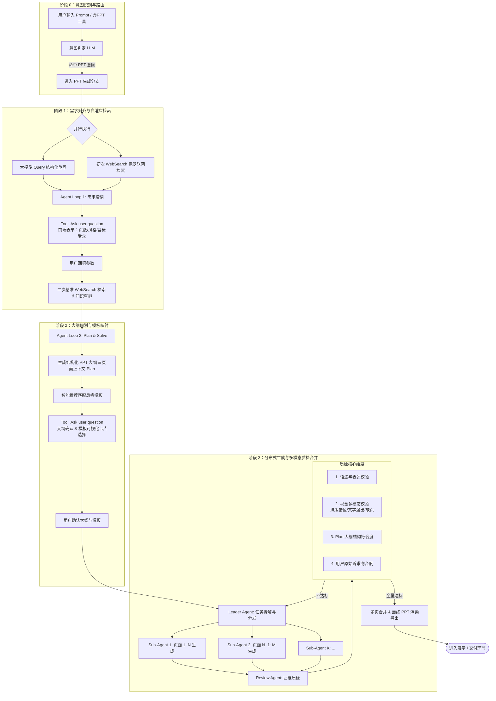

# PPT Agent Pro · 工业级全链路 AIGC 演示系统

> 本项目完整复现并落地了 **S0 意图识别与路由 $\rightarrow$ S1 WebSearch 联网检索与需求对齐 $\rightarrow$ S2 Plan-and-Solve 大纲规划与模板映射 $\rightarrow$ S3 Leader-Worker 分布式生成与 Review Agent 四维质检闭环** 的工业级 PPT Agent 架构。

---

## 🌟 核心全链路流程图 (S0 ~ S3)



---

## 🚀 模块与代码落点

| 阶段 | 核心机制 | 代码落点 |
| :--- | :--- | :--- |
| **阶段 0** | **意图识别与路由**：判定 `@PPT` 工具与自然语言生成意图 | `server/src/agents/intent-router.ts` |
| **阶段 1** | **WebSearch 联网检索**：初次宽泛检索 + 二次精准 Rerank<br/>**Agent Loop 1**：Query 结构化重写 + `Ask user question` 表单 | `server/src/tools/web-search.ts`<br/>`server/src/agents/clarification-agent.ts`<br/>`web/src/components/ClarificationForm.vue` |
| **阶段 2** | **Plan & Solve 大纲规划**：页面级结构化 Plan 生成<br/>**模板映射**：智能匹配调色板与视觉规范<br/>**HITL 审批**：大纲与模板卡片双预览交互 | `server/src/agents/plan-strategist.ts`<br/>`server/src/agents/template-matcher.ts`<br/>`web/src/components/PlanApprovalModal.vue` |
| **阶段 3** | **Leader-Worker 拓扑**：大纲拆解为 SubTask 并发分发<br/>**Sub-Agent 渲染**：独立生成高质量 SVG 页面<br/>**Review Agent 四维质检**：语法、视觉排版、Plan符合度、诉求吻合度<br/>**自省修复回路**：`autoFix` 局部补丁与打回重做 | `server/src/agents/leader-agent.ts`<br/>`server/src/agents/worker-agent.ts`<br/>`server/src/agents/review-agent.ts`<br/>`web/src/components/ReviewDashboard.vue` |
| **底层通信** | **14 阶段有限状态机 + SSE 实时流 + queryID 检查点** | `server/src/core/state-machine.ts`<br/>`server/src/sse/event-bus.ts`<br/>`server/src/workflow/checkpoint.ts` |

---

## 🛠️ 快速启动与演示

```bash
# 1. 进入项目目录
cd advanced-ppt-agent

# 2. 安装依赖
npm install

# 3. 运行单元测试
npm run test

# 4. 运行终端端到端完整链路演示
npm run demo

# 5. 启动 Web 全栈双端开发服务 (localhost:5188)
npm run dev
```
