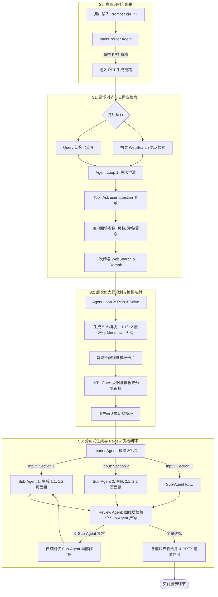

# 模块 00 · 全局架构与状态机全景篇 (Global Architecture & State Machine)

> **定位**：理解 PPT Agent Pro 的宏观技术蓝图、多智能体协同拓扑（Leader-Worker-Review）、14 阶段有限状态机以及 SSE 流式高可用通信机制。
> **代码落点**：`server/src/core/state-machine.ts`、`server/src/core/types.ts`、`server/src/sse/event-bus.ts`、`server/src/workflow/checkpoint.ts`

---

## 1. 业务痛点与架构演进

在工业级 AIGC 演示文稿生成场景下，传统单体方案通常存在三大致命缺陷：
1. **黑盒长等待**：一次性调用 LLM 生成整份 PPT，耗时长达数分钟，用户中途无法感知进度，稍有网络抖动就会导致全盘失败；
2. **上下文污染与 Token 爆炸**：若将 10~20 页的全部内容塞进单一 Agent 上下文，后半部分页面极易出现风格漂移与遗忘；
3. **单点失败整篇报废**：中间某页排版出错或格式崩溃时，缺乏独立的自省质检机制，只能全部重新生成。

针对上述痛点，本项目设计了 **S0~S3 四阶段 Industrial Multi-Agent Pipeline**。

---

## 2. 全链路 Multi-Agent 架构全景图



---

## 3. 核心机制 1：14 阶段显式有限状态机 (FSM)

### 3.1 为什么必须使用显式状态机？
在复杂的长流程 Agent 编排中，若仅使用 `if-else` 或隐式 Promise 链，极易在**用户打回修改、异常重试、断线恢复**时出现“非法状态越权跳转”或“死锁”。

本项目在 `server/src/core/state-machine.ts` 中定义了纯函数式的显式状态转移表 `ADVANCED_PPT_TRANSITIONS`：

```typescript
// server/src/core/state-machine.ts
export const ADVANCED_PPT_TRANSITIONS: TransitionRule[] = [
  { from: 'S0_intent_routing', to: 'S1_query_rewrite_search1', reason: 'intent_matched' },
  { from: 'S1_query_rewrite_search1', to: 'S1_agent_loop1_clarify', reason: 'auto' },
  { from: 'S1_agent_loop1_clarify', to: 'S1_hitl_clarify_wait', reason: 'auto' },
  { from: 'S1_hitl_clarify_wait', to: 'S1_search2_precise_rerank', reason: 'hitl_clarify_submit' },
  { from: 'S1_search2_precise_rerank', to: 'S2_agent_loop2_plan', reason: 'auto' },
  { from: 'S2_agent_loop2_plan', to: 'S2_template_match', reason: 'auto' },
  { from: 'S2_template_match', to: 'S2_hitl_plan_template_wait', reason: 'auto' },
  { from: 'S2_hitl_plan_template_wait', to: 'S3_leader_dispatch', reason: 'hitl_plan_approve' },
  { from: 'S3_leader_dispatch', to: 'S3_subagent_executing', reason: 'auto' },
  { from: 'S3_subagent_executing', to: 'S3_review_subagent_checking', reason: 'auto' },
  { from: 'S3_review_subagent_checking', to: 'S3_merge_export', reason: 'review_pass' },
  { from: 'S3_review_subagent_checking', to: 'S3_review_rework', reason: 'review_rework' },
  { from: 'S3_review_rework', to: 'S3_subagent_executing', reason: 'auto' },
  { from: 'S3_merge_export', to: 'done', reason: 'auto' }
];
```

**关键机制**：
- 任何非法的阶段跃迁（例如试图直接从 `S0` 跳到 `done`）都会被 `canTransition()` 拦截并抛出 `InvalidTransitionError`。
- 状态机每次发生 `transition()`，触发 `onEnter` 钩子：
  1. `state.enteredAt = Date.now()` 记录时间戳；
  2. `state.seq += 1` 维护递增序列号；
  3. `writeCheckpoint(state)` 原子写盘持久化；
  4. `bus.publish('stage.enter', state)` 实时推送到前端 SSE。

---

## 4. 核心机制 2：SSE 流式通信与断线续传

在前端与服务端之间，通过 **Server-Sent Events (SSE)** 实现单向低开销的流式状态同步：
1. **Ring Buffer 内存缓存**：服务端维护大小为 2048 的环形事件缓冲区（`event-bus.ts`）；
2. **Last-Event-ID 增量续传**：当客户端网络波动断开重连时，HTTP 请求头携带 `Last-Event-ID: 104`，服务端调用 `bus.replaySince(104)` 将断线期间丢失的消息精准重放补齐；
3. **指数退避 + Full Jitter 重试**（`backoff.ts`）：重连间隔计算公式 $T = \text{random}(0, \min(T_{\max}, T_{\text{base}} \times 2^{\text{attempt}}))$，避免百万客户端在服务器重启时产生瞬时网络风暴。

---

## 5. 高频面试追问与标准回答

### Q1：为什么状态机自己实现而不直接用开源库如 XState？
> **满分回答模板**：
> “在我们的 PPT Agent 场景中，状态集是固定的 14 个阶段，业务的核心诉求是**极低的依赖开销、严格的转移表序列化、以及与 SSE 事件总线和 queryID 检查点的原子绑定**。
> XState 功能虽然全面，但 Actor 模型与复杂的嵌套状态在 Node 服务端与 Checkpoint 持久化时带来了额外的认知与序列化开销。
> 我们自主封装的 `AdvancedStateMachine` 仅用几十行代码实现了**零外部依赖、显式转移校验、生命周期钩子（onEnter/onLeave）与持久化恢复通道（recover）**，架构更轻量、可控度更高，且具备 100% 的单元测试覆盖。”

### Q2：系统如果遇到断网或进程崩溃，任务如何保证不丢失？
> **满分回答模板**：
> “我们设计了‘双层恢复机制’：
> 1. **客户端断线**：浏览器基于 EventSource 的 `Last-Event-ID` 机制自动重连，服务端通过 RingBuffer 重放增量事件；
> 2. **服务端进程崩溃**：每次状态流转均通过 `writeCheckpoint()` 执行 ‘先写临时文件 `.tmp` $\rightarrow$ `fsync` $\rightarrow$ 原子 `rename`’ 的落盘流程，杜绝写一半损坏。系统重启后可通过 `WorkflowRunner.runFromCheckpoint(queryID)` 恢复到中断前的阶段继续推进。”
