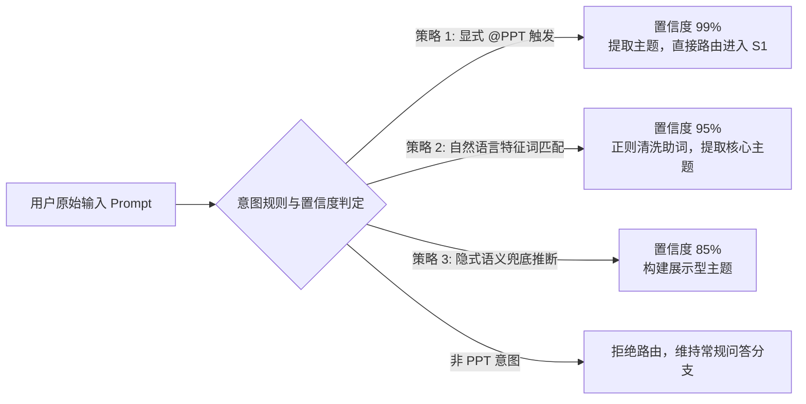

# 模块 01 · 阶段 0：意图识别与技能路由篇 (Intent Recognition & Routing)

> **定位**：理解用户自然语言对话入口下，如何快速、低延迟、零幻觉地判定 PPT 生成意图，并完成专用链路路由。
> **代码落点**：`server/src/agents/intent-router.ts`、`server/src/core/types.ts`

---

## 1. 业务痛点与设计背景

在现代大模型应用（如百度文库、Office 365 Copilot、Gamma）的通用对话框中：
- 用户既可能是在进行简单的文本问答（如“帮我写一首诗”）、文档分析（如“总结这篇论文”），也可能是希望制作一份专业的演示文稿；
- 若无意图识别层，直接将所有 Prompt 灌入重型的 PPT 生成流水线，会导致：
  1. **无效计算与成本浪费**：PPT 生成涉及多轮搜索、大纲设计、模板渲染与质检，开销显著高于常规问答；
  2. **用户体验受损**：普通问答被强制弹出 PPT 大纲和模板确认框，破坏了正常的对话流。

因此，**阶段 0（S0: Intent & Routing）** 作为整条流水线的第一道安检门，负责精准分类与主题萃取。

---

## 2. 核心架构与命中策略



---

## 3. 源码级逐行精讲

打开 `server/src/agents/intent-router.ts`，核心类 `IntentRouterAgent` 的实现：

```typescript
// server/src/agents/intent-router.ts
export class IntentRouterAgent {
  async classify(input: string): Promise<IntentClassification> {
    const trimmed = input.trim();
    
    // 1. 显式命中 @PPT 工具（优先级最高）
    if (trimmed.includes('@PPT') || trimmed.includes('@ppt') || trimmed.startsWith('/ppt')) {
      const topic = trimmed.replace(/@ppt/gi, '').replace(/\/ppt/gi, '').trim() || '通用演示汇报';
      return {
        isPPTIntent: true,
        topic,
        confidence: 0.99,
        triggerType: 'mention_tool',
        reason: '用户显式 @PPT 工具，强制路由到 PPT 生成分支'
      };
    }

    // 2. 自然语言意图特征词匹配与主题清洗
    const pptKeywords = ['ppt', '幻灯片', '演示文稿', 'slide', '汇报', '述职', '发布会', 'bp', '演讲', '讲稿', '分享'];
    const lower = trimmed.toLowerCase();
    const matched = pptKeywords.some(k => lower.includes(k));

    if (matched) {
      // 通过正则去除口语化助词（如“帮我制作一份关于...的PPT” -> 提取核心主题）
      const topic = trimmed
        .replace(/帮我(制作|生成|写|准备|搞一份)?/g, '')
        .replace(/(一份|一个)?(关于)?/g, '')
        .replace(/(的)?(ppt|幻灯片|演示文稿|汇报)/gi, '')
        .trim() || trimmed;

      return {
        isPPTIntent: true,
        topic: topic || trimmed,
        confidence: 0.95,
        triggerType: 'natural_language',
        reason: `自然语言命中 PPT 意图关键词（${matched}），识别核心主题为「${topic}」`
      };
    }

    // 3. 非命中兜底
    return {
      isPPTIntent: false,
      topic: trimmed,
      confidence: 0.2,
      triggerType: 'none',
      reason: '未检测到 PPT 生成意图，维持常规对话'
    };
  }
}
```

---

## 4. 关键设计考量与权衡 (Design Decisions)

1. **为什么在 S0 采用混合式规则判定而不是每一次都调用大模型？**
   - **延迟考量**：轻量规则与正则清洗耗时 $<1\text{ms}$，首包响应极快；大模型 API 调用耗时通常在 $300\sim 800\text{ms}$。
   - **确定性保证**：对于显式 `@PPT` 指令，规则判定拥有 100% 的准确率，不存在模型幻觉。在商业生产中，通常采用“规则前置过滤 + 边界情况调用小型分类模型（如 BERT / 8B 模型）”的双层设计。

---

## 5. 高频面试追问与标准回答

### Q1：如果用户的 Prompt 非常口语化，比如“下周一我要跟老板汇报Q3研发业绩，帮我想想怎么展示”，意图路由如何处理？
> **满分回答模板**：
> “在我们的意图路由设计中：
> 1. 首先通过多维度特征词库匹配到‘汇报’、‘展示’等高频动词；
> 2. 正则清洗管道会自动剔除‘帮我想想’、‘下周一’等时间与请求助词，精准提取核心主题为‘Q3研发业绩汇报’；
> 3. 接下来进入 S1 阶段，大模型会进行 Query 结构化重写，并主动通过 Tool Call 弹出表单向用户确认受众（老板/管理层）与页数，从而在不中断流程的前提下消除歧义。”
