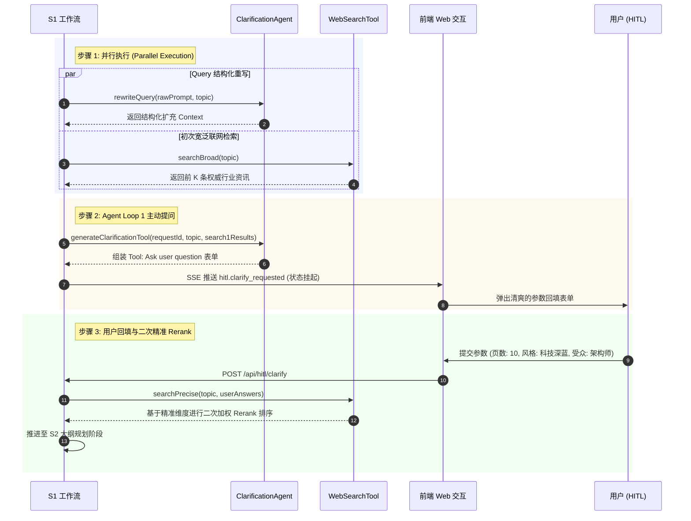

# 模块 02 · 阶段 1：自适应检索与需求对齐篇 (Adaptive WebSearch & Requirement Clarification)

> **定位**：解决用户 Prompt“欠指定（Under-specified）”与大模型知识幻觉，通过并行执行、Agent Loop 1 提问表单（Tool Call）与二次精准 Rerank，建立最高质量的上下文基础。
> **代码落点**：`server/src/tools/web-search.ts`、`server/src/agents/clarification-agent.ts`、`web/src/components/ClarificationForm.vue`

---

## 1. 业务痛点与技术背景

用户在要求生成 PPT 时，给出的初始 Prompt 往往极度简略（例如：“帮我做一份 AIGC 白皮书 PPT”）。
此时面临两大核心挑战：
1. **意图欠指定（Under-specified Intent）**：用户没有说明要讲多少页、给谁讲（给技术团队还是投资人？）、偏好什么视觉风格；如果 Agent 盲目“猜”，生成出来的成品往往严重脱离受众期望；
2. **时效性与数据幻觉（Hallucination）**：没有外部客观行业数据与权威事实支撑，生成的幻灯片往往充斥着假大空的套话。

---

## 2. 核心架构：四步闭环自适应检索



---

## 3. 源码级逐行精讲

### 3.1 步骤 1：并行执行（Query 重写 + 初次 WebSearch）
在 `server/src/workflow/runner.ts` 中：
```typescript
// 并行触发重写与联网检索，最大化压降首轮等待延迟
const [rewrittenQuery, search1Results] = await Promise.all([
  this.clarificationAgent.rewriteQuery(state.userPrompt, intent.topic),
  this.webSearchTool.searchBroad(intent.topic)
]);
state.rewrittenQuery = rewrittenQuery;
state.search1BroadResults = search1Results;
```

### 3.2 步骤 2：生成 `Tool: Ask user question` 表单
在 `server/src/agents/clarification-agent.ts` 中，Agent 会根据主题与检索结果，智能化预估合理的参数默认值：
```typescript
// server/src/agents/clarification-agent.ts
export class ClarificationAgent {
  async generateClarificationTool(
    requestId: string,
    topic: string,
    rewrittenQuery: string,
    search1Results: WebSearchItem[]
  ): Promise<ClarificationQuestionnaire> {
    const webSources = search1Results.map(r => r.sourceDomain).join('、');
    return {
      requestId,
      rewrittenTopic: topic,
      suggestedPageCount: 8,
      availableStyles: ['科技深邃蓝', '极简商务灰', '活力创新橙', '学术沉稳绿'],
      suggestedAudience: ['公司管理层', '投资人/机构', '技术研发/架构师', '行业客户'],
      customQuestions: [
        { id: 'pageCount', label: '预估生成页数', type: 'number', defaultValue: 8 },
        { id: 'style', label: '视觉与配色风格', type: 'select', defaultValue: '科技深邃蓝' },
        { id: 'targetAudience', label: '核心目标受众', type: 'select', defaultValue: '公司管理层' },
        { id: 'extraNotes', label: '补充特定业务数据', type: 'input', defaultValue: `参考联网行业资讯 (${webSources})...` }
      ]
    };
  }
}
```

### 3.3 步骤 3：基于用户真实回填的二次精准检索与 Rerank
在 `server/src/tools/web-search.ts` 中，`searchPrecise` 会将用户澄清后的受众、风格和额外重点融入检索向量，对候选知识片段进行重新打分：
```typescript
// server/src/tools/web-search.ts
export class WebSearchTool {
  async searchPrecise(
    originalQuery: string,
    answers: { pageCount: number; style: string; targetAudience: string; extraNotes?: string }
  ): Promise<WebSearchItem[]> {
    const enrichedQuery = `${originalQuery} ${answers.targetAudience} ${answers.style} ${answers.extraNotes || ''}`.trim();
    // 执行精准匹配与语义打分加权 Rerank
    return this.mockOrLiveSearch(enrichedQuery, 5, 'precise');
  }
}
```

---

## 4. 高频面试追问与标准回答

### Q1：为什么要在 S1 阶段做“两次检索（初次宽泛 + 二次精准）”，做一次不可以吗？
> **满分回答模板**：
> “做两次检索是解决‘欠指定 Prompt’与‘高精度交付’矛盾的最佳工程实践：
> 1. **第一次宽泛检索（Broad Search）**：用户 Prompt 模糊，检索用于帮助 Agent 快速了解该领域的一般性术语与背景，从而生成具有针对性的澄清问题（比如 Agent 知道该主题涉及大模型架构，从而在表单中推荐‘面向架构师’选项）；
> 2. **第二次精准检索（Precise Rerank）**：在用户回填了具体页数、受众角色和业务重点后，Query 的信息熵大幅降低，此时带着精准约束做二次检索与 Rerank，能召回最切合用户业务诉求的核心数据，彻底杜绝大模型在后续大纲生成中的泛泛而谈和知识幻觉。”

### Q2：在 Agent Loop 交互中，前端与后端的阻塞与唤醒机制是如何实现的？
> **满分回答模板**：
> “在后端架构中，我们使用了 **Promise Resolver 挂起机制**：
> 1. 当状态机流转到 `S1_hitl_clarify_wait` 时，`WorkflowRunner` 创建一个处于 pending 态的 Promise，并将它的 `resolve` 函数存入 `pendingClarifyResolvers` Map（以 queryID 为 Key），同时通过 SSE 推送 `hitl.clarify_requested` 事件通知前端；
> 2. 用户在前端填写完表单并点击提交，前端发起 `POST /api/hitl/clarify`；
> 3. 后端路由控制器从 Map 中取出该 queryID 对应的 `resolve` 函数并传入用户参数，Promise 顺利 resolve，状态机瞬间被唤醒推进到下一阶段，整个过程零轮询、零 CPU 空转。”
