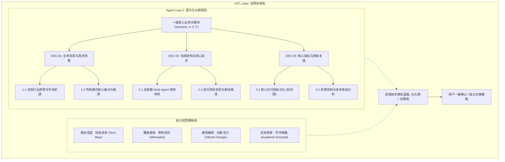

# 模块 03 · 阶段 2：层次化大纲规划与模板解耦篇 (Hierarchical Outline & Template Decoupling)

> **定位**：解决长篇 PPT（10~20 页）中大纲与页面的结构映射混乱问题，引入两级层次化 Markdown 章节大纲树，并实现大纲规划与视觉模板的完全解耦（HITL 双预览）。
> **代码落点**：`server/src/agents/plan-strategist.ts`、`server/src/agents/template-matcher.ts`、`web/src/components/PlanApprovalModal.vue`

---

## 1. 业务痛点与技术难点

在很多初级 PPT 生成实现中，往往采用“1 个大纲条目 = 1 个 PPT 页面”的扁平映射方式。
然而在真实业务场景中，这种方式存在严重缺陷：
1. **结构失衡与逻辑混乱**：用户想要一份 15 页的汇报 PPT，不可能要求大模型生成 15 个一级大纲。合格的演示文稿必然是由 **4~5 个核心业务板块（Section）** 构成，每个板块下细分出 **2~3 个子论点页面（1.1, 1.2, 2.1...）**；
2. **大纲与视觉深度耦合**：如果在生成大纲时就硬编码具体的排版样式和颜色，用户想更换主题模板时就必须推倒大纲重来，造成极大的 Token 浪费。

---

## 2. 核心架构：两级层次化大纲与解耦映射



---

## 3. 源码级逐行精讲

### 3.1 两级层次化数据模型定义
在 `server/src/core/types.ts` 中：
```typescript
/** 二级页面子主题 (如 1.1, 1.2 等) */
export interface OutlineSubSection {
  subId: string;       // "1.1", "1.2"
  title: string;       // 子主题标题
  pageType: 'content' | 'chart' | 'summary';
  bulletPoints: string[]; // 核心论点要点
  suggestedVisual: string; // 视觉与版式建议
  chartData?: {
    type: 'bar' | 'line' | 'pie';
    title: string;
    series: Array<{ name: string; value: number }>;
  };
}

/** 一级核心板块 (如 "01 · 核心架构与技术创新") */
export interface OutlineSection {
  sectionId: number;
  sectionCode: string; // "SEC-01"
  title: string;       // 一级大模块名称
  summary: string;     // 模块定位
  subSections: OutlineSubSection[]; // 内部 1.1, 1.2 等子分块
}

/** 完整层次化 Plan */
export interface HierarchicalPlan {
  title: string;
  themeStyle: string;
  targetAudience: string;
  totalSlides: number;
  markdownOutline: string; // 完整的 Markdown 大纲文本
  sections: OutlineSection[];
}
```

### 3.2 大纲规划 Agent (Plan Strategist)
在 `server/src/agents/plan-strategist.ts` 中，Agent 将用户需求与搜索数据结构化提炼为标准 Markdown 大纲：
```typescript
// 自动组装 Markdown 章节大纲树
const mdLines: string[] = [
  `# ${topic}`,
  `> 目标受众：${answers.targetAudience} | 视觉风格：${answers.style}`,
  ''
];

sections.forEach(sec => {
  mdLines.push(`## ${sec.title}`);
  mdLines.push(`*模块定位：${sec.summary}*`);
  sec.subSections.forEach(sub => {
    mdLines.push(`- **[${sub.subId}] ${sub.title}** (${sub.pageType})`);
    sub.bulletPoints.forEach(bp => mdLines.push(`  - ${bp}`));
  });
  mdLines.push('');
});
```

### 3.3 模板匹配与解耦设计
在 `server/src/agents/template-matcher.ts` 中，每张模板卡片仅定义**调色板（Palette）、字体（FontFamily）与场景规则**，与页面逻辑内容完全解耦：
```typescript
export interface TemplateCard {
  id: string;
  name: string;
  styleName: string;
  palette: {
    primary: string;
    secondary: string;
    background: string;
    text: string;
    accent: string;
  };
  fontFamily: string;
}
```

---

## 4. 高频面试追问与标准回答

### Q1：为什么要把大纲（Plan）和模板（Template）做完全解耦的设计？
> **满分回答模板**：
> “这体现了现代软件工程中的**关注点分离（Separation of Concerns）与职责解耦**：
> 1. **大纲负责语义与逻辑维度**：解决‘讲什么内容、论点怎么层层递进、数据图表如何分布’；
> 2. **模板负责视觉与样式维度**：解决‘调色板规范、版心留白、字体族与装饰元素’；
> 3. **极佳的交互自由度与重算成本优化**：在 HITL 审批阶段，如果用户觉得默认模板太花哨，点击切换为‘商务炭灰’模板，后端**仅需更新调色板上下文，大纲数据 0 毫秒重算、0 Token 消耗**；若不解耦，更换风格就得重新调用大模型重写大纲，带来巨大的延迟和成本浪费。”

### Q2：两级层次化大纲（Section + SubSection）给后续的 S3 多智能体生成带来了什么优势？
> **满分回答模板**：
> “两级结构是实现 **Leader-Worker 模块级分布式生成** 的基石：
> Leader Agent 不需要将整份庞大的大纲一股脑扔给每个 Worker，而是把每一个独立的一级 Section（及其包含的 1.1、1.2 完整上下文）作为一个自治的任务包精准分发给对应的 Sub-Agent。
> 这样每个 Sub-Agent 既拥有足够的局部上下文来保障页面连贯性，又不会被全局长文本撑爆上下文窗口。”
