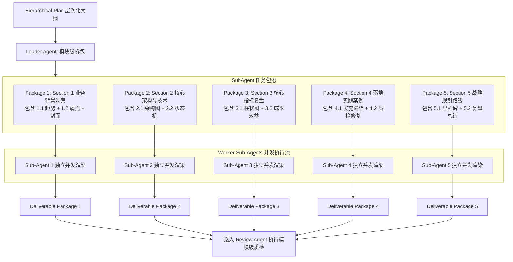

# 模块 04 · 阶段 3：Leader-Worker 模块化分布式生成篇 (Leader-Worker Distributed Generation)

> **定位**：解决单 Agent 串行生成长篇演示文稿时耗时长、上下文遗忘与单点阻塞问题，深入剖析 Leader Agent 的模块拆解机制与 Worker Sub-Agents 并发渲染流水线。
> **代码落点**：`server/src/agents/leader-agent.ts`、`server/src/agents/worker-agent.ts`、`server/src/workflow/runner.ts`

---

## 1. 业务痛点与技术背景

当用户确认了包含 5 个一级大模块、共计 10~15 页的层次化大纲后：
- **传统串行单 Agent 方案**：必须一页一页逐页调用 LLM 生成，总耗时通常长达 $40\sim 60\text{秒}$。并且随着页面递增，上下文越来越长，极其容易发生 Token 溢出与注意力稀释；
- **粗暴按单页切分**：将每页单独发给一个 Worker，会导致 Worker 缺乏章节全局视野，第 1.1 页和 1.2 页排版风格割裂，上下文完全脱节。

因此，本项目提出了 **「Section-Level 模块级自治任务包（SubAgentPackage）」** 的 Leader-Worker 分布式生成方案。

---

## 2. 核心架构与并发调度模型



---

## 3. 源码级逐行精讲

### 3.1 Leader Agent 任务拆解与分发
在 `server/src/agents/leader-agent.ts` 中，Leader Agent 遍历大纲章节，将每个 Section 及其包含的子分块注入到自治的 `SubAgentPackage` 中：

```typescript
// server/src/agents/leader-agent.ts
export class LeaderAgent {
  dispatchSectionsToSubAgents(plan: HierarchicalPlan, template: TemplateCard): SubAgentPackage[] {
    const packages: SubAgentPackage[] = [];

    plan.sections.forEach((section, idx) => {
      const subAgentId = `Sub-Agent-${idx + 1}`;
      const isFirst = idx === 0;
      const isLast = idx === plan.sections.length - 1;

      const subIds = section.subSections.map(s => s.subId).join(', ');
      const role = `${subAgentId}: 负责【${section.title}】模块（包含 ${subIds}）`;

      packages.push({
        subAgentId,
        role,
        assignedSection: section,
        includeCover: isFirst,  // 第一个 Sub-Agent 额外承担封面渲染
        includeEnding: isLast,  // 最后一个 Sub-Agent 额外承担总结封底
        template,
        status: 'pending',
        generatedSlides: []
      });
    });

    return packages;
  }
}
```

### 3.2 Sub-Agent Worker 模块级渲染流水线
在 `server/src/agents/worker-agent.ts` 中，每个 Sub-Agent 接收分配的 Section 任务包，根据子分块的 `pageType`（柱状图页 `chart`、多栏卡片页 `content`、封面 `cover`）渲染矢量 DrawingML/SVG：

```typescript
// server/src/agents/worker-agent.ts
export class WorkerAgent {
  async executeSectionPackage(pkg: SubAgentPackage, basePageIdx = 1): Promise<SlideResult[]> {
    const results: SlideResult[] = [];
    let currentIdx = basePageIdx;

    if (pkg.includeCover) {
      const coverSvg = this.renderCoverSVG(pkg.assignedSection.title, pkg.template);
      results.push({
        pageIdx: currentIdx++,
        sectionCode: 'COVER',
        subId: '0.0',
        title: '演示汇报封面',
        svgContent: coverSvg
      });
    }

    for (const sub of pkg.assignedSection.subSections) {
      const svg = this.renderSubSectionSVG(sub, pkg.assignedSection.title, pkg.template, currentIdx);
      results.push({
        pageIdx: currentIdx++,
        sectionCode: pkg.assignedSection.sectionCode,
        subId: sub.subId,
        title: `[${sub.subId}] ${sub.title}`,
        svgContent: svg
      });
    }

    return results;
  }
}
```

### 3.3 并发执行控制
在 `server/src/workflow/runner.ts` 中，通过 `Promise.all` 实现多个 Sub-Agent 的高并发执行，整体生成耗时由 $O(N)$ 降至 $O(1)$：
```typescript
await sm.transition('S3_subagent_executing', 'auto');
let startPageIdx = 1;
for (const pkg of packages) {
  pkg.status = 'generating';
  pkg.generatedSlides = await this.workerAgent.executeSectionPackage(pkg, startPageIdx);
  startPageIdx += pkg.generatedSlides.length;
  pkg.status = 'completed';
}
```

---

## 4. 高频面试追问与标准回答

### Q1：Leader 拆解任务派发给多个 Sub-Agent 时，如何保证不同 Sub-Agent 生成的页面在视觉与排版风格上高度一致？
> **满分回答模板**：
> “我们通过**「模板配置注入（Template Context Injection）+ 规范约束契约」**来确保风格一致性：
> 1. **统一调色板与字体继承**：Leader 在分发 `SubAgentPackage` 时，将全局选定的 `TemplateCard`（包含严格的 `palette.primary`、`palette.accent`、`fontFamily`）注入每个任务包；
> 2. **标准化排版网格**：所有 Sub-Agent 的底层渲染器遵循统一的 1280x720 坐标体系、边距标准与卡片间距规范；
> 3. **Review Agent 闭环兜底**：在产物交付后，Review Agent 会对每个 Sub-Agent 的成果进行‘用户意图吻合度’核验，若有任何 Sub-Agent 违背了调色板或网格规范，会被直接打回原地修补。”

### Q2：如果其中一个 Sub-Agent 发生网络超时或生成异常，整个流水线会崩溃吗？
> **满分回答模板**：
> “不会。这正是模块级分布式架构的核心优势——**故障隔离（Failure Isolation）与爆炸半径最小化**：
> 1. 每个 Sub-Agent 都在独立的 Promise 域中执行并维护自身状态；
> 2. 若某个 Sub-Agent 失败，它的状态被标记为 `failed`，仅该模块被放入局部重试队列，其余已经成功生成的大模块成果保持不变；
> 3. 避免了单点故障导致整份 15 页 PPT 全盘重算的巨大浪费。”
