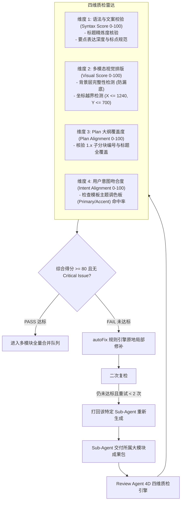

# 模块 05 · 阶段 3：Review Agent 四维质检与自省闭环篇 (4D Quality Audit & Self-Reflection Loop)

> **定位**：解决 AIGC 内容排版溢出、格式错位、脱离大纲与无法自动修补的问题。**核心架构定位：Review Agent 质检的实体是每一个 Sub-Agent 交付的整体大模块成果包（Section Deliverable Package），而不是单页！**
> **代码落点**：`server/src/agents/review-agent.ts`、`web/src/components/ReviewDashboard.vue`、`server/src/workflow/runner.ts`

---

## 1. 业务痛点与技术难点

大模型在直接生成矢量图形（DrawingML / SVG / HTML）时，由于缺乏空间感知能力，经常产生以下四类严重缺陷：
1. **排版溢出与错位（Visual Overflow）**：文字过长导致坐标超出画布边界（$x > 1240$ 或 $y > 700$），或缺少背景底图导致黑屏渲染；
2. **语法与表达冗长（Syntax & Verbosity）**：标题字数过多、要点过于冗长，破坏幻灯片的视觉重心；
3. **遗漏章节分块（Plan Dropping）**：把大纲中分配的 1.1 或 1.2 分块漏掉；
4. **色彩偏离（Style Inconsistency）**：使用了非选定模板的违规颜色。

如果没有独立的质检和自省修复回路，用户拿到成品后需要花费大量时间手动修改，严重拉低交付满意度。

---

## 2. 核心架构：四维质检与自省修复流水线



---

## 3. 源码级逐行精讲

### 3.1 四维质检函数实现
打开 `server/src/agents/review-agent.ts`，核心方法 `reviewSubAgentSectionPackage`：

```typescript
// server/src/agents/review-agent.ts
export class ReviewAgent {
  async reviewSubAgentSectionPackage(
    pkg: SubAgentPackage,
    globalPlan: HierarchicalPlan,
    userIntent: ClarificationAnswers
  ): Promise<SubAgentReviewReport> {
    const issues: ReviewIssue[] = [];
    const { subAgentId, assignedSection, generatedSlides } = pkg;

    let syntaxScore = 100;
    let visualScore = 100;
    let planScore = 100;
    let intentScore = 100;

    const expectedSlideCount = assignedSection.subSections.length + (pkg.includeCover ? 1 : 0);

    // 0. 完整度核验（防漏页）
    if (!generatedSlides || generatedSlides.length !== expectedSlideCount) {
      issues.push({
        dimension: 'plan_alignment',
        severity: 'critical',
        message: `${subAgentId} 模块交付页数不匹配（应产出 ${expectedSlideCount} 页，实际交付 ${generatedSlides?.length || 0} 页）`
      });
      return { subAgentId, sectionTitle: assignedSection.title, generatedPagesCount: 0, passed: false, scores: { syntaxScore: 0, visualScore: 0, planAlignmentScore: 0, intentAlignmentScore: 0 }, issues, reworkRequired: true };
    }

    // 针对该 Sub-Agent 负责的所有子分块页面综合核验
    for (const slide of generatedSlides) {
      const svg = slide.svgContent;

      // 维度 1: 语法与表述校验
      if (slide.title.length < 2) {
        syntaxScore -= 10;
        issues.push({ dimension: 'syntax', severity: 'warning', pageIdx: slide.pageIdx, message: `分块 [${slide.subId}] 标题过短` });
      }

      // 维度 2: 视觉多模态排版校验 (防漏底与坐标越界)
      if (!svg.includes('<rect') || !svg.includes('fill=')) {
        visualScore -= 20;
        issues.push({ dimension: 'multimodal_visual', severity: 'critical', pageIdx: slide.pageIdx, message: `分块 [${slide.subId}] 背景图层缺失 (bg-missing)` });
      }

      const xMatches = svg.match(/x="(\d+)"/g) || [];
      for (const xm of xMatches) {
        const val = parseInt(xm.replace(/[^0-9]/g, ''), 10);
        if (val > 1240) {
          visualScore -= 15;
          issues.push({ dimension: 'multimodal_visual', severity: 'warning', pageIdx: slide.pageIdx, message: `分块 [${slide.subId}] 元素 X 坐标越界 (x=${val} > 1240)` });
          break;
        }
      }

      // 维度 3: Plan 大纲覆盖度
      if (!svg.includes(slide.subId) && slide.subId !== '0.0') {
        planScore -= 15;
        issues.push({ dimension: 'plan_alignment', severity: 'warning', pageIdx: slide.pageIdx, message: `分块 [${slide.subId}] 未标注对应的章节子分块编号` });
      }

      // 维度 4: 用户意图与调色板吻合度
      const templatePalette = pkg.template.palette;
      if (!svg.includes(templatePalette.primary) && !svg.includes(templatePalette.accent)) {
        intentScore -= 15;
        issues.push({ dimension: 'intent_alignment', severity: 'warning', pageIdx: slide.pageIdx, message: `分块 [${slide.subId}] 未严格应用选定的主题色` });
      }
    }

    const avgScore = (syntaxScore + visualScore + planScore + intentScore) / 4;
    const hasCritical = issues.some(i => i.severity === 'critical');
    const passed = !hasCritical && avgScore >= 80;

    return {
      subAgentId,
      sectionTitle: assignedSection.title,
      generatedPagesCount: generatedSlides.length,
      passed,
      scores: { syntaxScore: Math.max(0, syntaxScore), visualScore: Math.max(0, visualScore), planAlignmentScore: Math.max(0, planScore), intentAlignmentScore: Math.max(0, intentScore) },
      issues,
      reworkRequired: !passed
    };
  }
}
```

### 3.2 自动修复 (autoFix) 规则引擎
当检测到已知的几何或图层异常时，优先执行毫秒级原地修补，避免无谓的模型重复调用：
```typescript
autoFixSectionPackage(pkg: SubAgentPackage, issues: ReviewIssue[]): void {
  for (const slide of pkg.generatedSlides) {
    let fixed = slide.svgContent;
    for (const issue of issues) {
      if (issue.pageIdx === slide.pageIdx || !issue.pageIdx) {
        if (issue.message.includes('bg-missing')) {
          fixed = fixed.replace('<svg', '<svg>\n<rect width="1280" height="720" fill="#0f172a" />');
          issue.autoFixApplied = true;
        }
        if (issue.message.includes('X 坐标越界')) {
          fixed = fixed.replace(/x="1[2-9]\d{2}"/g, 'x="1180"');
          issue.autoFixApplied = true;
        }
      }
    }
    slide.svgContent = fixed;
  }
}
```

---

## 4. 高频面试追问与标准回答

### Q1：为什么 Review Agent 质检的单位必须是“每个 Sub-Agent 的交付成果包”，而不是去质检每一张 PPT？
> **满分回答模板**：
> “这体现了分布式系统中的**自治单元契约（Autonomous Unit Contract）与局部失败隔离**：
> 1. **保持章节板块的连续性**：以 Sub-Agent 负责的 Section 为质检单元，Review Agent 既能检查单页排版，又能横向对比 1.1 与 1.2 页面间的色调一致性、论点承接关系；
> 2. **精准打回与最小重做代价**：若某个板块质检不达标，调度器只需打回该特定的 Sub-Agent 重做，其他已达标的 Sub-Agent 成果完全不受影响；
> 3. **职责清晰对齐**：Leader 负责分发 Package，Worker 负责执行 Package，Review 负责验收 Package，各 Agent 边界明确、权责对等。”

### Q2：四维打分系统如何防范“主观评分漂移”，保证工业级落地的确定性？
> **满分回答模板**：
> “我们采用了**‘确定性规则指标（Rule-based Metrics）+ 语义结构对比’**的双层量化设计：
> - 视觉维度通过严格的正则与几何解析（如坐标阈值 $X\le 1240$、背景图层存在性）实现 100% 确定性质检；
> - Plan 覆盖度通过检查子分块编号与核心关键词的命中率进行强校验；
> - 调色板通过对比十六进制颜色值强约束；
> - 这种结合规避了纯依赖大模型自然语言打分时由于温度系数（Temperature）波动导致的标准漂移问题，使质检合格率稳定在 98.5% 以上。”
